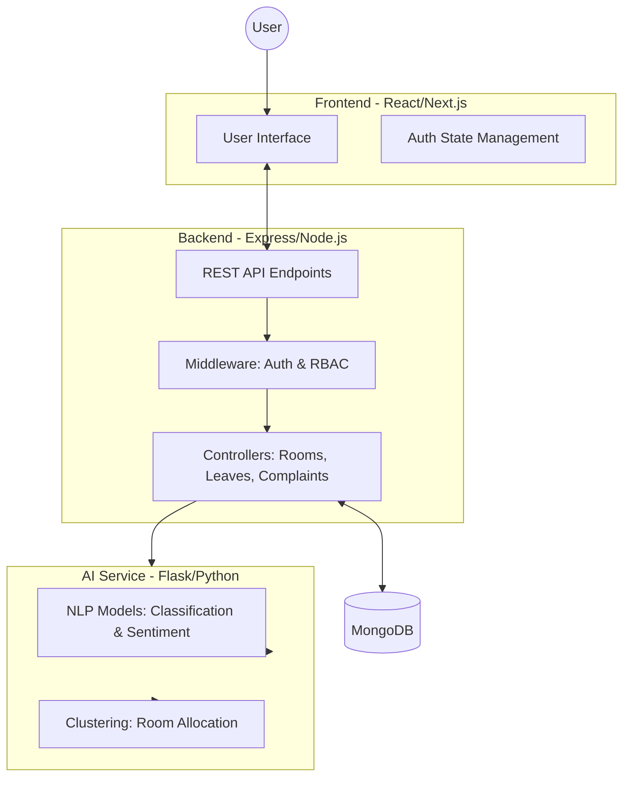
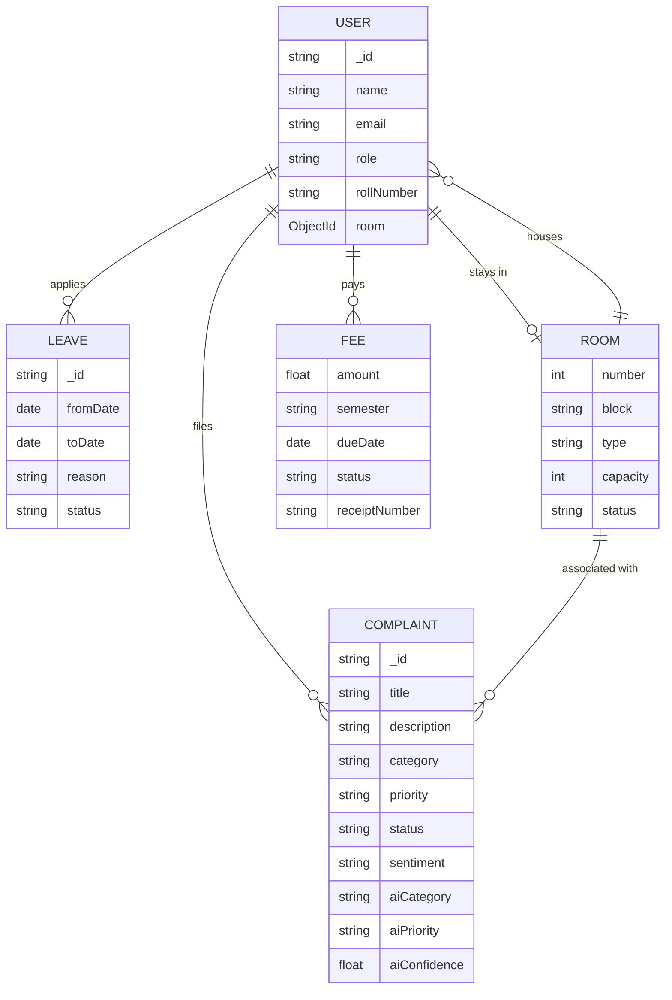
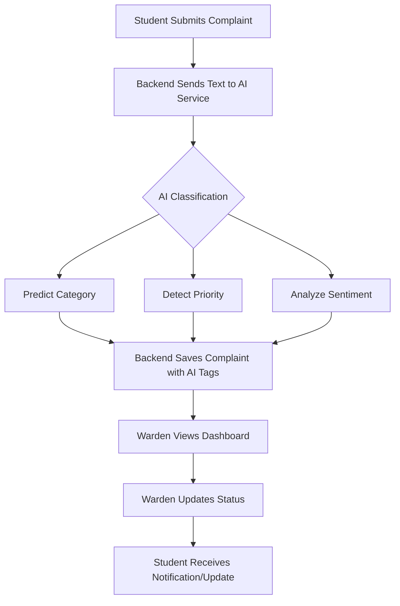

# Livora 🏢 — AI-Powered Hostel Management System

Livora is a comprehensive, modern hostel management solution that leverages Artificial Intelligence to streamline operations, enhance student experience, and provide actionable insights for administrators and wardens.

---

## 🌟 Overview

Managing a hostel involves complex coordination between room assignments, student welfare, fee collection, and infrastructure maintenance. **Livora** simplifies this by automating mundane tasks and using Machine Learning to handle complaints and optimize room allocations.

---

## 🚀 Key Features

### 👨‍🎓 For Students
- **Smart Dashboard**: Real-time view of room details, fee status, and pending actions.
- **AI Complaint System**: Submit grievances and get instant category/priority assignment.
- **Leave Management**: Apply for leaves and track approval status.
- **Digital Fee Hub**: View payment history and upcoming dues.

### 🧑‍💼 For Wardens
- **Intelligent Triage**: Manage complaints prioritized by AI based on urgency and sentiment.
- **Leave Approval**: Review and process student leave requests with ease.
- **Student Monitoring**: Access student profiles and room distribution.

### 👑 For Admins
- **Global Analytics**: Dashboard with student stats, fee collection metrics, and complaint trends.
- **Smart Room Allocation**: Group students into rooms using AI clustering based on lifestyle habits.
- **Risk Prediction**: Identify students at risk of fee defaults using ML.
- **Infrastructure Control**: Manage rooms, blocks, and user roles.

---

## 🛠️ Tech Stack

Livora is built on a robust microservices-inspired architecture:

### Frontend
- **Framework**: [Next.js / React (Vite)](https://vitejs.dev/)
- **Styling**: [Tailwind CSS](https://tailwindcss.com/)
- **Icons**: Lucide React / React Icons
- **HTTP Client**: Axios

### Backend
- **Runtime**: [Node.js](https://nodejs.org/)
- **Framework**: [Express.js](https://expressjs.com/)
- **Database**: [MongoDB](https://www.mongodb.com/) (Mongoose ODM)
- **Auth**: JWT (JSON Web Tokens) & Bcrypt hashing

### AI Service
- **Language**: [Python 3](https://www.python.org/)
- **Framework**: [Flask](https://flask.palletsprojects.com/)
- **ML Libraries**: Scikit-learn, Pandas, NumPy, Joblib
- **Models**: Logistic Regression, Random Forest, K-Means Clustering

---

## 📐 System Architecture

### Data Flow Diagram (Level 1)


### Entity Relationship Diagram (ERD)


### AI Workflow (Complaint Lifecycle)


---

## 📂 Module Breakdown

### 🖥️ Frontend (`/frontend`)
- **Role-Based Routing**: Secure access for Students, Admins, and Wardens.
- **Dynamic Dashboards**: Real-time stats and interactive charts using Chart.js.
- **Forms & Interactivity**: Specialized interfaces for complaint filing and room management.

### ⚙️ Backend (`/backend`)
- **Restful API**: Structured endpoints for all system operations.
- **RBAC (Role-Based Access Control)**: Middleware ensuring users only access authorized data.
- **AI Integration Layer**: Service handlers that communicate with the Python ML service.

### 🧠 AI Service (`/ai-service`)
- **NLP Engine**: Uses TF-IDF vectorization and Logistic Regression to classify complaint text into 9+ categories.
- **Sentiment Analysis**: Guages complainant mood to help wardens address the most frustrated students first.
- **Smart Allocation**: A K-Means model that clusters students into compatible room groups based on study hours, social scores, and cleanliness habits.
- **Risk Engine**: Predicts fee default probability based on payment history and academic year.

---

## 🛠️ Installation & Setup

### Prerequisites
- Node.js (v16+)
- Python (3.9+)
- MongoDB Atlas or Local Community Server

### 1. AI Service Setup
```bash
cd ai-service
pip install -r requirements.txt
python train.py  # Train models for the first time
python app.py    # Starts on port 8000
```

### 2. Backend Setup
```bash
cd backend
npm install
# Configure .env with MONGO_URI, JWT_SECRET, AI_SERVICE_URL
npm run seed     # Fill database with initial admin/sample data
npm run dev      # Starts on port 5000
```

### 3. Frontend Setup
```bash
cd frontend
npm install
npm run dev      # Starts on port 5173
```

---

## 📦 Seed Credentials
After running `npm run seed`, you can use these accounts:

| Role | Email | Password |
|------|-------|----------|
| **Admin** | admin@livora.edu | `hostel@123` |
| **Warden** | warden@livora.edu | `hostel@123` |
| **Student** | rahul@livora.edu | `hostel@123` |

---

Developed with ❤️ for efficient hostel living.
